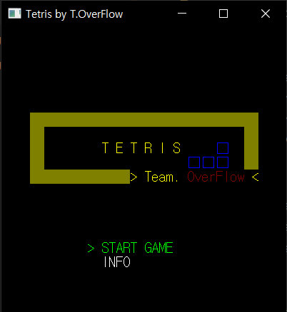
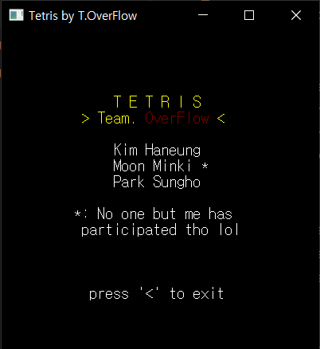
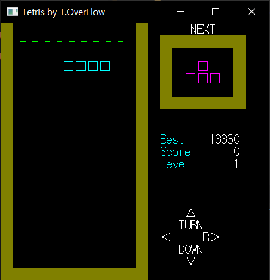

# <h1 align="center">Tetris</h1>

<p align="center">
!! This project is a toy project and a study, so any bugs can happen !!
</p>

<p align="center">
    
    
    <a href="./LICENSE"></a>
</p>

<p align="center">
A simple Tetris game developed in C, but with a spoon of OOP.<br>
This project is built along the AIW (Anyway, It Works!) structure.
</p>

### Screenshots
<p align="center">
    
    
    
</p>

# License
```
Designed and developed by 2022~2023 mooner1022 (Minki Moon)

This program is free software: you can redistribute it and/or modify
it under the terms of the GNU General Public License as published by
the Free Software Foundation, either version 3 of the License, or
any later version.

This program is distributed in the hope that it will be useful,
but WITHOUT ANY WARRANTY; without even the implied warranty of
MERCHANTABILITY or FITNESS FOR A PARTICULAR PURPOSE.  See the
GNU General Public License for more details.

You should have received a copy of the GNU General Public License
along with this program.  If not, see <http://www.gnu.org/licenses/>.
```
